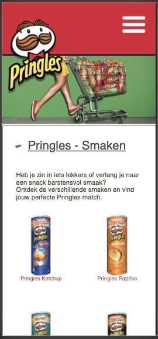
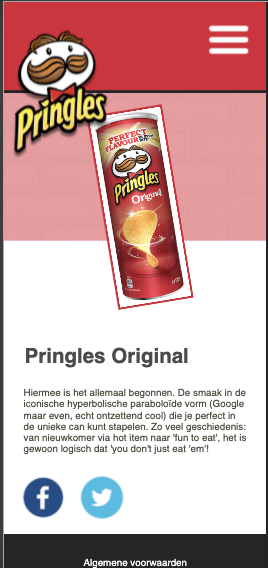
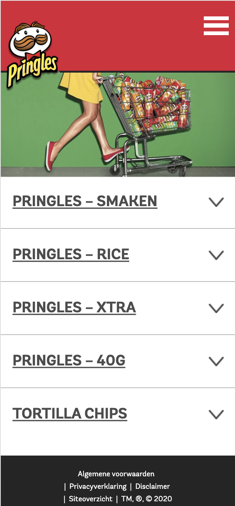
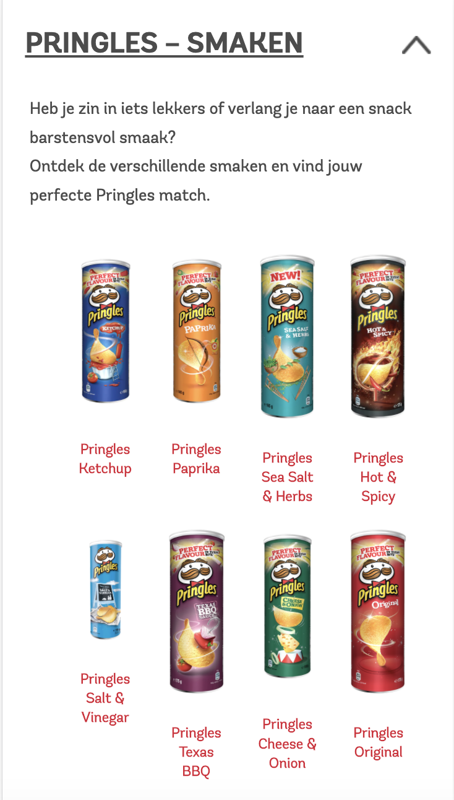
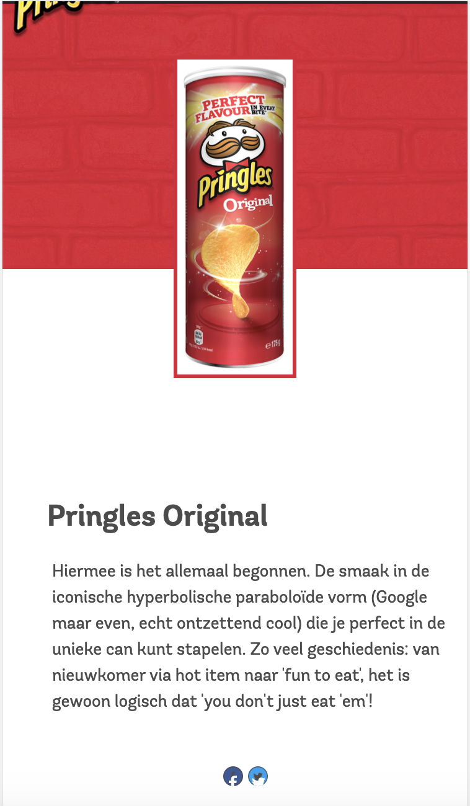
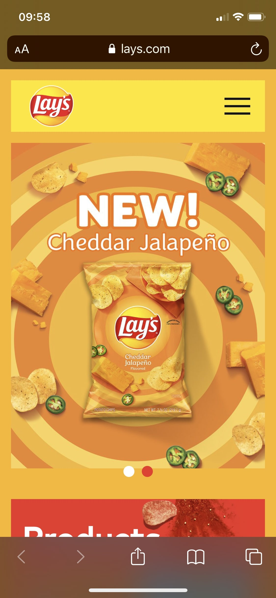
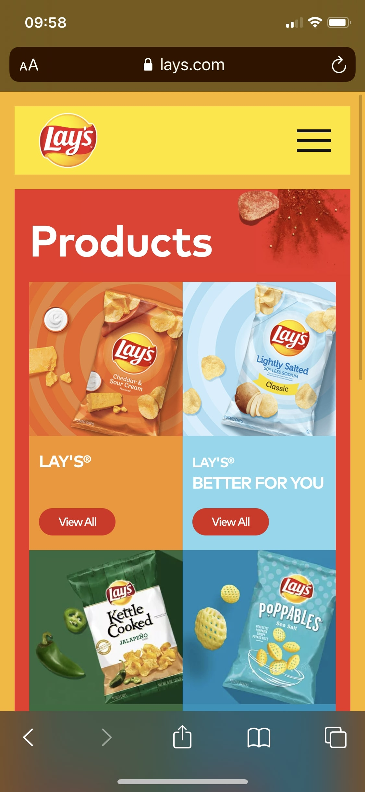
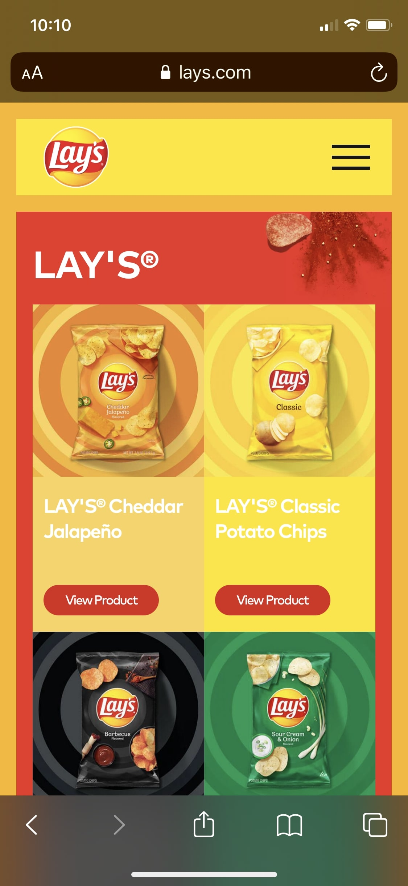
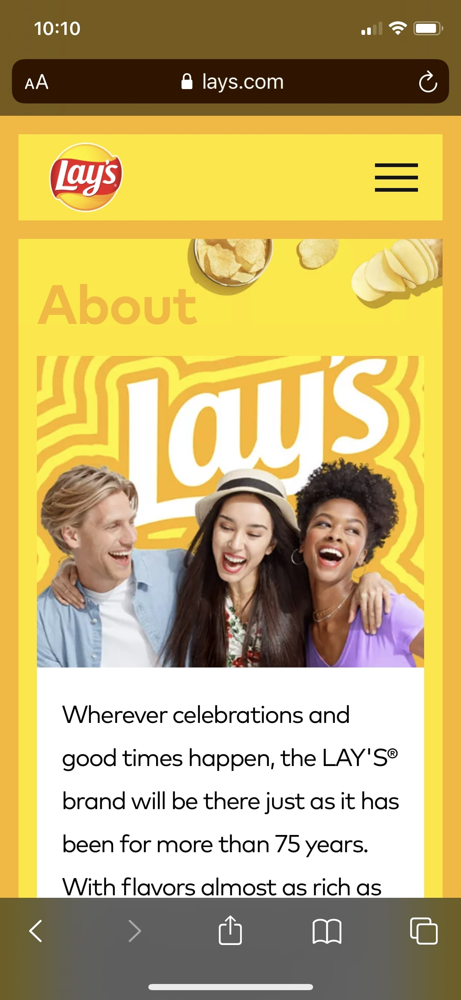

# Procesverslag
**Auteur:** Emilio Manduapessij

## Bronnenlijst
1. https://www.lays.com/ -> https://www.pringles.com/
2. W3 schools, via https://www.w3schools.com/
3. Markdown cheat cheet, via https://github.com/adam-p/markdown-here/wiki/Markdown-Cheatsheet
4. https://css-tricks.com/snippets/css/complete-guide-grid/
5. https://www.freecodecamp.org/news/taking-the-right-approach-to-responsive-web-design/
6. https://www.smashingmagazine.com/2018/12/generic-css-mobile-first/
7. https://developer.mozilla.org/en-US/docs/Web/HTML/Element/details

## Eindgesprek (week 7/8)

-dit ging goed & dit was lastig-

**Screenshot(s):**

-screenshot(s) van je eindresultaat-

## Voortgang 3 (week 6)

Feedback Danny de Vries:
Kijk goed naar je semantische correctheid m.b.t. het gebruik van Sections. Als je sections gebruikt moet je daarvoor H2 gebruiken. Pas dit toe en vind een semantisch correcte manier hiervoor. 

Na dit gesprek ben ik gaan kijken naar alternatieve oplossingen. Het gebruik van 5x een Div is niet gebruikelijk. Ik heb ervoor gekozen om de <sections> weg te halen. Hierdoor bevinden de Details->Summary elementen zich onder elkaar. Dit heb ik echter wel onderverdeeld in de benaming: Uitklapbalk 1 t/m 5. Dit werkt voor mij overzichtelijk en is volgens mij Semantisch correct.

Ik had de basis staan. Echter was mijn detail-pagina nog te karig. Ik wilde hieraan wat elementen toevoegen die ik heb opgepikt uit de les. Dit bevat het gebruik van het correct toevoegen van Grid, het vergroten van scale bij het hoveren van de image (.smaken li:hover {transform: scale(1.2);), Animaties (Ik heb een bewegende pringle-bus gemaakt bij het hoveren van de IMG en de achtergrond bewegend gemaakt (infaden) dit heb ik mede gerealiseerd door de bronnen waarbij ze ook het gebruik van @keyframes wat inhield het onderverdelen van 4 states in percentages zoals 25% en 50% en bij een bepaalde state een transform toe te passen op de image). Uiteraard ook uit bronnen overgenomen. 

Als javascript element heb ik de oefening van de hamburger menu gepakt. Ik heb dit toegepast op beiden pagina's. Dit heb ik 1 keer geoefent en daarna nog vanuit de bron afgelezen hoe ik dit moest toepassen in mijn html en css. Hierin zat voor mij nog de meeste tijd aangezien de javacript taal bij mij aardig is weggezakt van vorige jaar. Ik heb dit vak wel gehaald toentertijd maar het was voor mij weer even wennen hoe je een event aanmaakt en dit logisch overziet in je hoofd. 

Als laatste ben ik gaan kijken naar de kleinere elementen uit de website zoals het toevoegen van een subtiele underline van een uitklap menu op de homepagina. Dit soort kleine toevoegen laat de nagemaakte website meer aanvoelen als de originele website. 

  

  

## Voortgang 2 (week 5)

Omdat ik me heb gerealiseerd dat ik later ben ingestapt en vervolgens overhaast een website heb gekozen plus proberen te maken. Ben ik bij mezelf tot de conclusie gekomen dat ik met een schone lei wilde beginnen. Ik heb mijn code tot dusver verwijderd en ben begonnen met een nieuwe code met daarin de behandelde stof tot en nu toe. Ik ben net begonnen met het toepassen van het JS. element. Ik wil van de hamburger menu, een uitklap menu maken met daarin het icoon (hamburgermenu) veranderend in een kruisje zodra je erop tapt. Verder heb ik de html uitgewerkt van de landingspagina en met css al redelijk ver. Er ontbreekt echter nog wat subtiele animatie wat is toegepast op de de website: https://www.pringles.com/.

## Wat ging goed?

Ik heb het gevoel dat het nu stapsgewijs de goede kant op gaat. Ook qua planning. Ik heb een nieuwe website gekozen. En ben stapsgewijs aan de slag gegaan met het opbouwen van deze website. Ook heb ik om veel hulp gevraagd van mijn huisgenoot omdat hij voormalig CMD'er is en mij goed kon helpen met het opbouwen van de structuur van de website. De html staat, css bijna volledig. Alleen het toevoegen een 2e pagina en het toevoegen van animaties en javascript ontbreekt nog, dit word wel lastig.

## Wat ging er minder goed?

Het lettertype ontbreekt nog. Ik moet achterhalen welk lettertype het meest lijkt op die van de website. Ook heb ik veel moeite met het toevoegen van Hover en animaties. Ik wil per pringle bus een animatie creeren waarbij er wordt ingezoomd op de pringle bus, of dat de pringle bus 180 graden kan draaien als voorbeeld. Hierin moet ik veel bronnen opzoeken omdat ik zelf niet weet hoe dit moet.

## Breakdownschets

  

**Screenshot(s) van de huidige nieuwe pagina's:**

  

  

## Voortgang 1 (week 3)

### Stand van zaken

Momenteel ben ik volledig vastgelopen met het ontwerp. Omdat mijn breakdown schets niet volledig was, ben ik erachter gekomen dat mijn code door elkaar heen loopt. Ik ben het overzicht verloren en elke keer als ik mijn gemaakte code wilde aanpassen, moest ik minuten lang zoeken hoe ik bepaalde elementen (zoals het uitlijnen van de tekst) kon veranderen, mede door verkeerde onlogische naamgeving. Ik heb besloten om opnieuw te beginnen omdat ik daarmee denk dat ik meer kans maak op een goede code en dus een voldoende. Ik ben nu begonnen om een breakdown te maken van Pringles. Ik heb gekozen voor Pringles omdat ik áltijd Pringles eet, en daarmee het wellicht wat leuker maak voor mijzelf om hiervan een website na te bootsen. 

### Agenda voor meeting

- Mijn voortgang tot nu toe.
- Welke elementen missen er.
- Sluit mijn breakdownschets aan bij mijn gemaakte html-code.
- In hoeverre is mijn css al aansluitend bij de website.

Feedback Danny:

Kijk nog even goed naar de breakdown. Je kan je schermontwerp nog verder uitpluizen. Het is nog niet volledig afgebroken. Als je ervoor zorgt dat je je breakdown schets compleet hebt, creeer je hiermee een fundament waarbij je duidelijk en stapsgewijs je code kunt maken.

## Breakdownschets (week 1)

  

## Intake (week 1)
Intake gemist omdat ik ben ingestroomd tijdens week 2/3.

**Je startniveau:** Blauw

**Je focus:** Surface plane

**Je opdracht:** https://www.pringles.com/

**Screenshot(s) van de huidige pagina's:**

  

  

